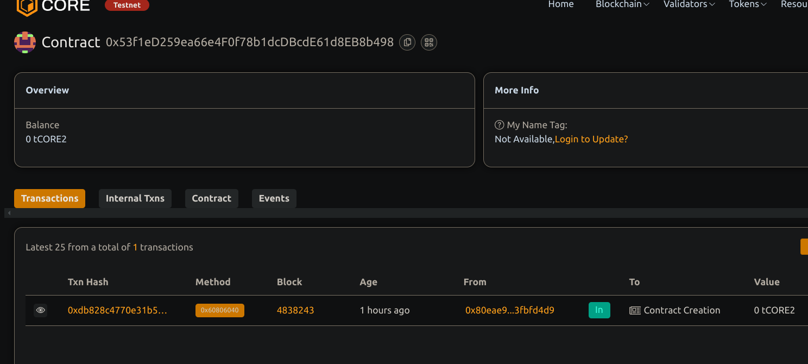

# NFT Rental System with Time-Based Access

## 📖 Project Description

This smart contract enables NFT owners to lend their assets temporarily by locking them in a contract and granting time-based access to renters. After the rental period ends, the NFT is returned automatically to the original owner.

## 🌍 Project Visions.

To create a secure and permissionless NFT leasing protocol where digital assets such as game items, art, or access passes can be rented out on-chain for a specific time duration.

## 🔑 Key Features

- List NFTs for rent with time-based conditions
- On-chain ownership transfer during rental
- Renters can access NFTs only within a defined time window
- Automatic return to owner after the rental period
- Rental status tracking and transparency

## 🚀 Future Scope

- Fee-based renting and royalties
- Integration with ERC4907 (rental extension of ERC721)
- dApp interface for managing rentals.
- Off-chain authentication for NFT access during rental period
- Support for batch listing and rental auctions

## Contract details
0x53f1eD259ea66e4F0f78b1dcDBcdE61d8EB8b498

